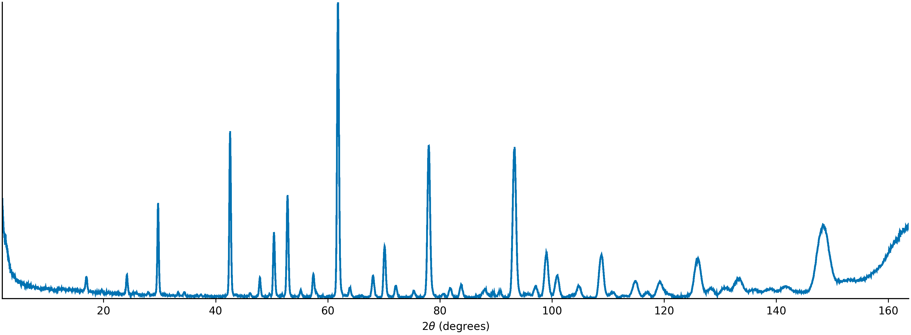
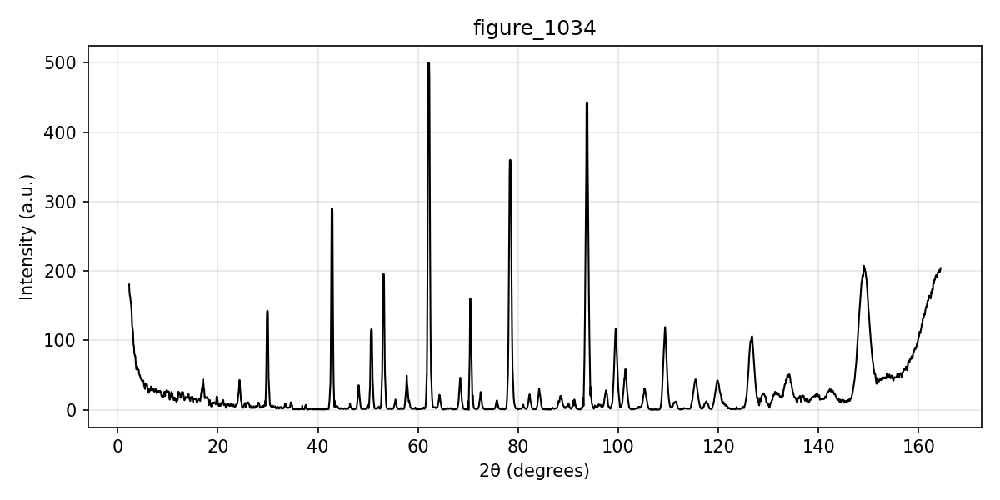
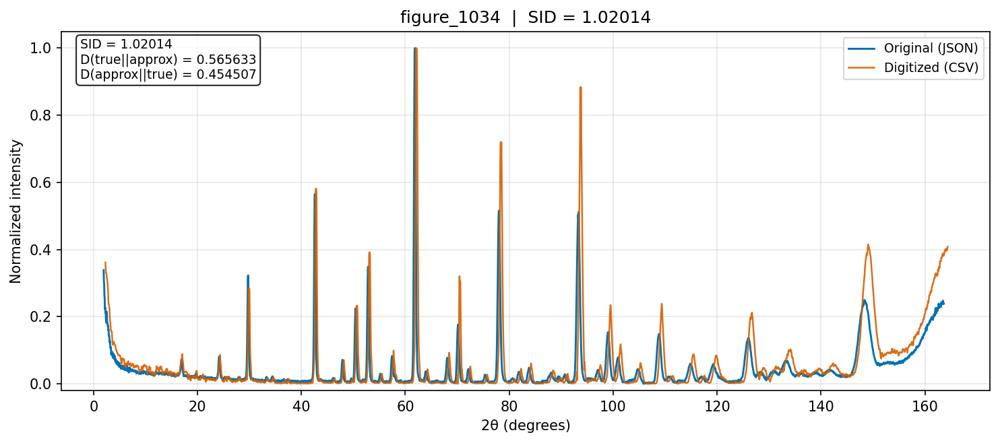

# XRD Digitization

Digitize XRD figure images into calibrated CSV curves and preview PNGs, using axis OCR plus [PlotDigitizer](https://github.com/dilawar/PlotDigitizer).

## Setup

```bash
git clone --recurse-submodules git@github.com:KeanuNakamura/xrd-digitization.git
cd xrd-digitization
python3 -m venv .venv && source .venv/bin/activate
python -m pip install --upgrade pip
python -m pip install -r requirements.txt
```

If you already cloned without submodules: `git submodule update --init`.

Install [Tesseract](https://github.com/tesseract-ocr/tesseract) for axis tick OCR (`brew install tesseract` on macOS).

## Usage

Digitize a folder of figure PNGs:

```bash
python plotdigitizer_pipeline.py examples/ --png-dir --output-dir output/
```

Alternate (deterministic package pipeline):

```bash
python -m xrd_digitization examples/figure_3.png --skip-classification
```

## Output

Each figure writes a CSV of `(x, y)` points plus a `_digitized.png` overlay. Multi-curve stacked plots are split into horizontal bands with one CSV/preview per band.

## Spectral Information Divergence (SID)

SID measures how different a digitized spectrum is from a ground-truth spectrum. Both intensity vectors are treated as probability distributions \(p\) and \(q\) (normalized to sum to 1). The directional divergences and symmetric SID are:

\[
D(p \parallel q) = \sum_i p_i \log\frac{p_i}{q_i}, \qquad
D(q \parallel p) = \sum_i q_i \log\frac{q_i}{p_i}, \qquad
\mathrm{SID} = D(p \parallel q) + D(q \parallel p)
\]

Lower is better; \(0\) means identical distributions. Overlays report the symmetric SID (see `compute_sid.py`).

## Examples

CNRS figure 1034 — original plot, reconstructed curve, and overlay against ground-truth JSON (SID ≈ 1.02).

<table>
  <tr>
    <td align="center" width="33%"><strong>Original</strong></td>
    <td align="center" width="33%"><strong>Digitized</strong></td>
    <td align="center" width="33%"><strong>Overlay</strong></td>
  </tr>
  <tr>
    <td align="center"></td>
    <td align="center"></td>
    <td align="center"></td>
  </tr>
</table>
