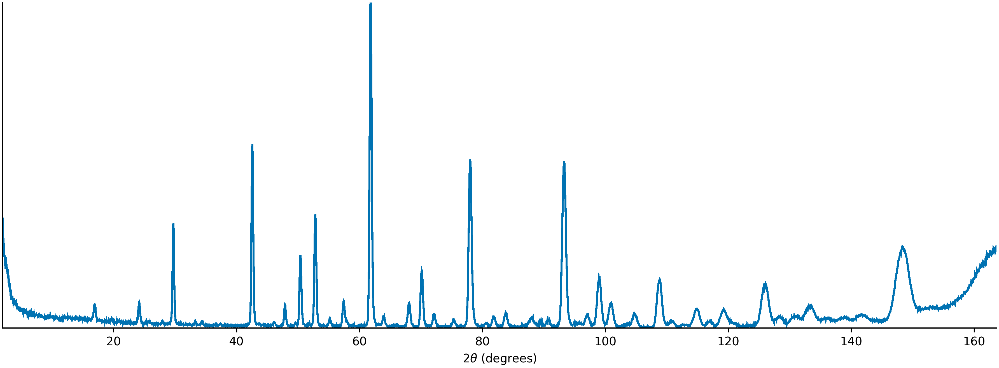
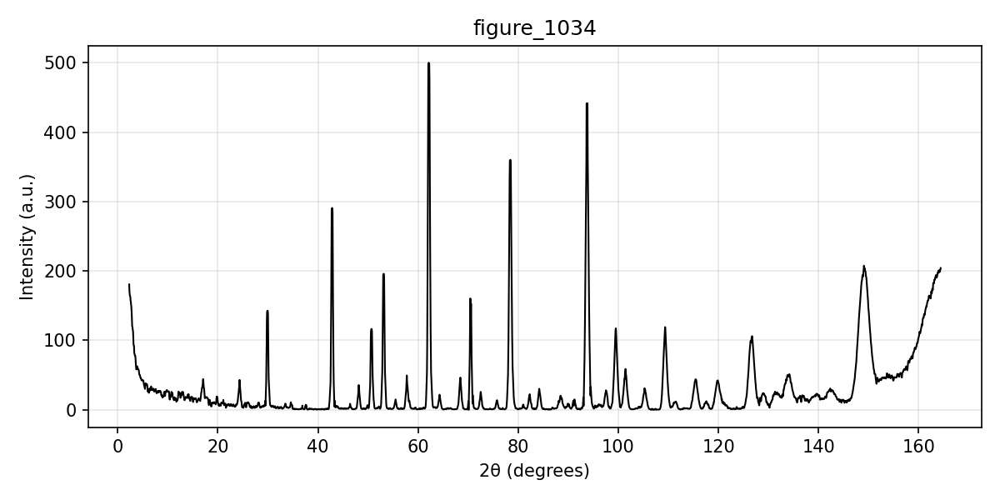
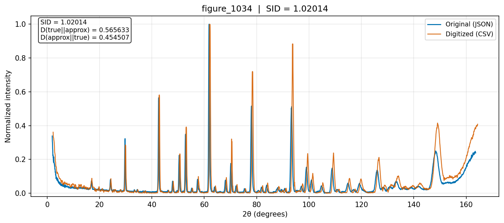
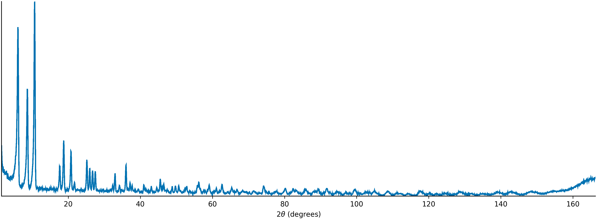
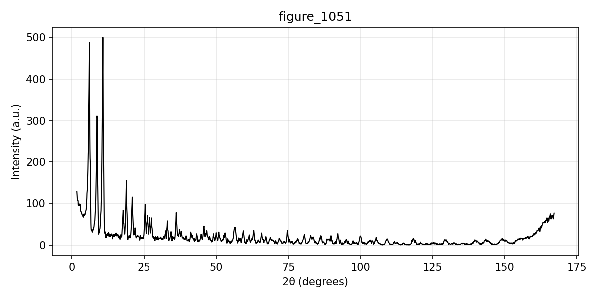
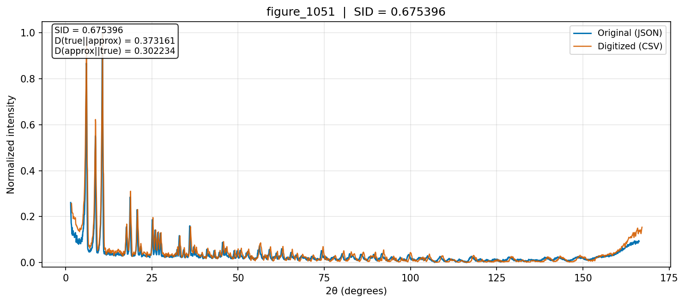
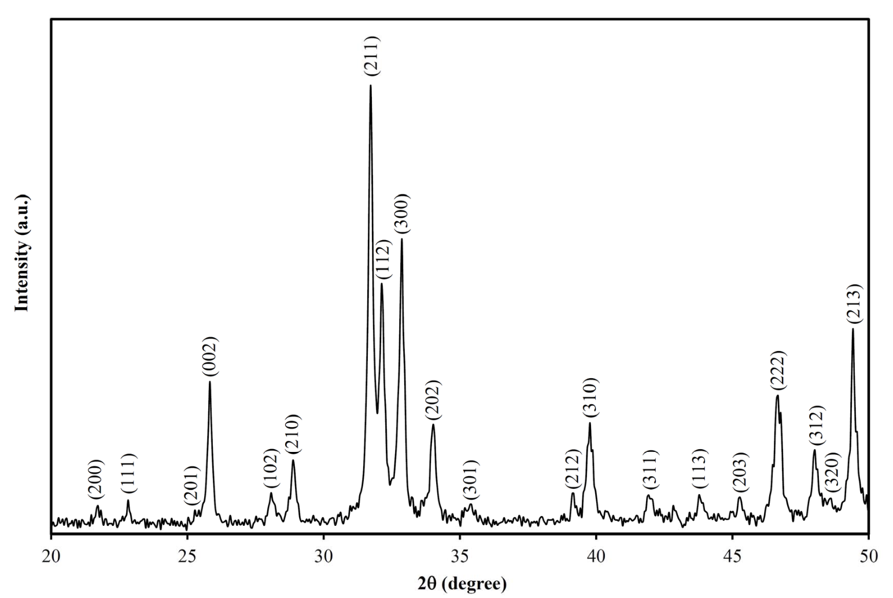
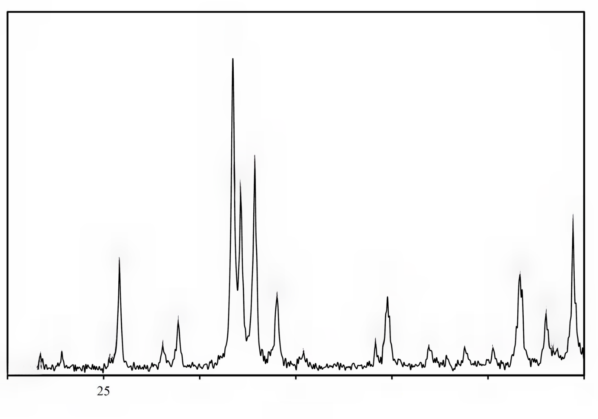
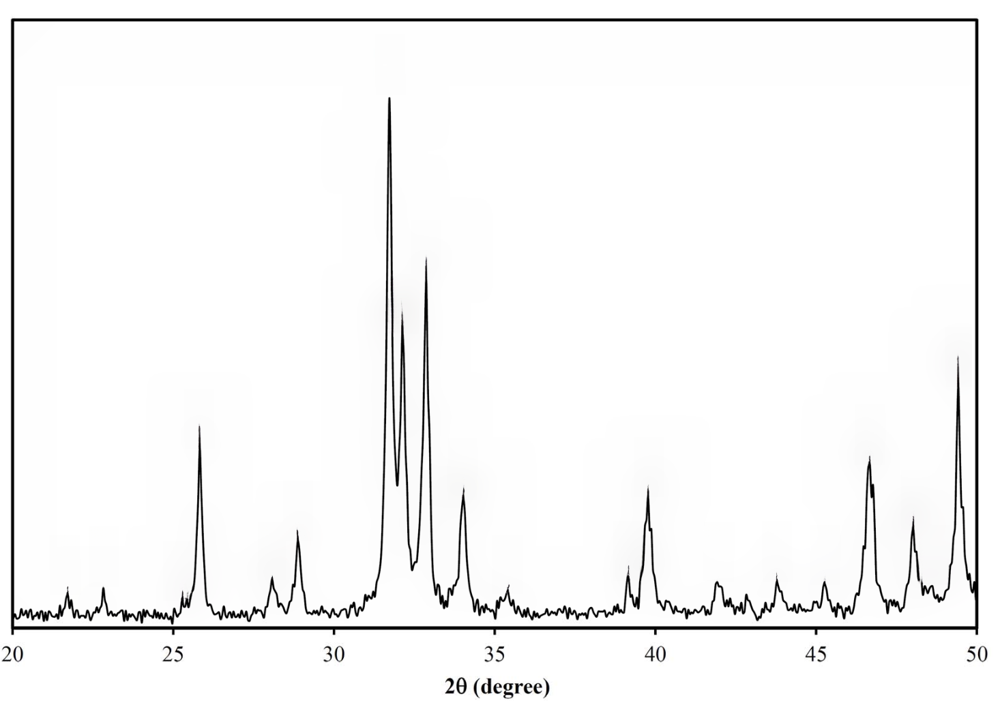
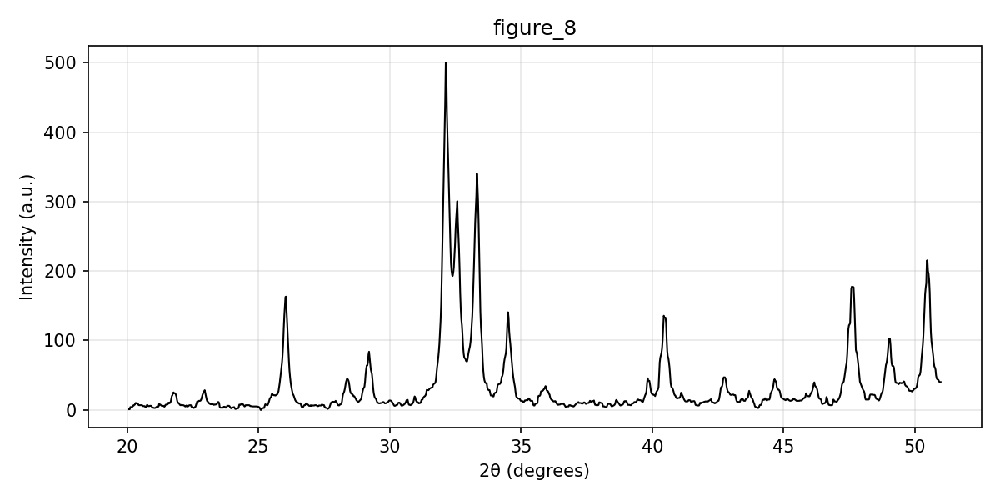

# XRD Digitization

Autonomously digitizes XRD figure images into calibrated CSV curves and preview PNGs, using axis OCR plus [PlotDigitizer](https://github.com/dilawar/PlotDigitizer).

## Setup

```bash
git clone --recurse-submodules git@github.com:KeanuNakamura/xrd-digitization.git
cd xrd-digitization
python3 -m venv .venv && source .venv/bin/activate
python -m pip install --upgrade pip
python -m pip install -r requirements.txt
```

If you already cloned without submodules: `git submodule update --init`.

Install [Tesseract](https://github.com/tesseract-ocr/tesseract) for axis tick OCR (`brew install tesseract` on macOS).

## Usage

Digitize one figure PNG (primary entry point):

```bash
python scripts/digitize_figure.py examples/figure_3.png output/
# → output/figure_3/figure_3.csv
# → output/figure_3/figure_3_digitized.png
```

By default this digitizes the original image and does **not** call ClipDrop (no API credits). To remove in-plot text with ClipDrop before digitizing:

```bash
export CLIPDROP_API_KEY=...
python scripts/digitize_figure.py examples/figure_3.png output/ --clipdrop
```

Digitize a folder of figure PNGs:

```bash
python scripts/digitize_figure.py examples/ output/
```

## Output

`scripts/digitize_figure.py` writes `output/<figure_id>/` containing a CSV of `(x, y)` points and a `_digitized.png` preview (plus the source PNG; with `--clipdrop`, also `<figure_id>_clean.png`). Multi-curve stacked plots are split into horizontal bands with one CSV/preview per band.

## Spectral Information Divergence (SID)

SID measures how different a digitized spectrum is from a ground-truth spectrum. Both intensity vectors are treated as probability distributions $p$ and $q$ (normalized to sum to 1). The directional divergences and symmetric SID are:

$$
D(p \parallel q) = \sum_i p_i \log\frac{p_i}{q_i}, \qquad
D(q \parallel p) = \sum_i q_i \log\frac{q_i}{p_i}, \qquad
\mathrm{SID} = D(p \parallel q) + D(q \parallel p)
$$

Lower is better; $0$ means identical distributions. Overlays report the symmetric SID (see `compute_sid.py`).

## Examples

CNRS figure 1034 — original plot, reconstructed curve, and overlay against ground-truth JSON (SID ≈ 1.02).

<table>
  <tr>
    <td align="center" width="33%"><strong>Original</strong></td>
    <td align="center" width="33%"><strong>Digitized</strong></td>
    <td align="center" width="33%"><strong>Overlay</strong></td>
  </tr>
  <tr>
    <td align="center"></td>
    <td align="center"></td>
    <td align="center"></td>
  </tr>
</table>

CNRS figure 1051 — original plot, reconstructed curve, and overlay against ground-truth JSON (SID ≈ 0.68).

<table>
  <tr>
    <td align="center" width="33%"><strong>Original</strong></td>
    <td align="center" width="33%"><strong>Digitized</strong></td>
    <td align="center" width="33%"><strong>Overlay</strong></td>
  </tr>
  <tr>
    <td align="center"></td>
    <td align="center"></td>
    <td align="center"></td>
  </tr>
</table>

### Figures with in-plot text

Many published XRD patterns label peaks with Miller indices or annotations that sit on the curve. With `--clipdrop`, the pipeline removes that in-plot text, then pastes the cleaned interior back onto the original so axis ticks and labels stay intact for OCR calibration.

Example: HA diffraction pattern at 900°C.

<table>
  <tr>
    <td align="center" width="25%"><strong>Original</strong></td>
    <td align="center" width="25%"><strong>Clean</strong></td>
    <td align="center" width="25%"><strong>Axes restored</strong></td>
    <td align="center" width="25%"><strong>Digitized</strong></td>
  </tr>
  <tr>
    <td align="center"></td>
    <td align="center"></td>
    <td align="center"></td>
    <td align="center"></td>
  </tr>
</table>

1. **Original** — peak labels such as `(211)` and `(300)` overlap the curve.
2. **Clean** — ClipDrop clears in-plot text from the plot interior (axis margins can be damaged if cleaned alone).
3. **Axes restored** — the cleaned interior is pasted back into the original so tick labels and axis titles remain byte-identical for calibration.
4. **Digitized** — PlotDigitizer traces the cleaned curve into calibrated CSV + preview.

> Monshi, A., Foroughi, M. R., & Monshi, M. R. (2012). Modified Scherrer Equation to Estimate More Accurately Nano-Crystallite Size Using XRD. *World Journal of Nano Science and Engineering*, *2*, 154–160. https://doi.org/10.4236/wjnse.2012.23020
